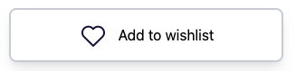

# PRODUCT MODAL


- [PRODUCT MODAL](#product-modal)
  - [Button Style](#button-style)
    - [Style 1](#style-1)
    - [Style 2](#style-2)

## Button Style

#### Style 1

- This style will create a button with 3D effect when hover


```html
<div class="group">
  <button
    class="w-full border-b-8 border-b-blue-700 bg-blue-700 text-white rounded-lg group-hover:border-t-8 group-hover:border-t-blue-700 group-hover:border-b-0 group-hover:shadow-lg transition-all duration-150"
  >
    <div
      class="bg-blue-500 px-8 py-4 rounded-lg group-hover:bg-blue-700 duration-150"
    >
      Add to cart
    </div>
  </button>
</div>
```

#### Style 2

- This style will create a button with shadow effect when hover



```html
<button
  class="border-2 border-gray-300 rounded-lg px-5 py-3 flex items-center justify-center space-x-3 hover:-translate-y-0.5 hover:shadow-lg transition-all duration-150"
>
  
  <span>Add to wishlist</span>
</button>
```
